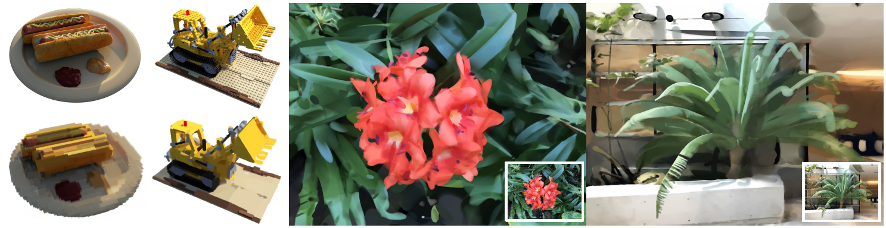

<div align="center">

<h1>Neural 3D Strokes: Creating Stylized 3D Scenes with Vectorized 3D Strokes</h1>

<div>
    <a href='' target='_blank'>Hao-Bin Duan<sup>1</sup></a>&emsp;
    <a href='http://miaowang.me/' target='_blank'>Miao Wang<sup>1, 2</sup></a>&emsp;
    <a href='' target='_blank'>Yan-Xun Li<sup>1</sup></a>&emsp;
    <a href='https://www.yongliangyang.net/' target='_blank'>Yong-Liang Yang<sup>3</sup></a>
</div>
<div>
    <sup>1</sup>State Key Laboratory of Virtual Reality Technology and Systems, Beihang University&emsp; 
    <sup>2</sup>Zhongguancun Laboratory&emsp;
    <sup>3</sup>Department of Computer Science, University of Bath
</div>
<div>
    <a href='https://arxiv.org/abs/2311.15637'>CVPR 2024</a>
</div>
<div>

<a target="_blank" href="https://arxiv.org/abs/2311.15637">
  
</a>
<a href="https://hits.seeyoufarm.com"></a>
</div>


<h4>TL;DR</h4>
<h5>Neural 3D Strokes generate stylized 3D scenes with vectorized 3D strokes. <br> Our method learns a vectorized stroke field instead of MLP-based implicit representation to represent a 3D scene. We construct a palette of 3D strokes based on geometric primitives and spline curves.</h5>

### [Paper](https://arxiv.org/abs/2311.15637) | [Project Page](https://buaavrcg.github.io/Neural3DStrokes)

<br>


<tr>
    
</tr>

<tr>
    <video width="80%" controls autoplay loop>
        <source src="./assets/orchid.mp4" type="video/mp4">
    </video>
</tr>

</div>


## Setup
We highly recommend using [Anaconda](https://www.anaconda.com/) to manage your python environment. You can setup the required environment by the following commands:
```bash
# clone this repo
git clone https://github.com/buaavrcg/Neural3DStrokes
cd Neural3DStrokes

# install python dependencies
conda env create -f environment.yml
conda activate n3dstrokes
```

Dependent CUDA code is compiled on the fly when you run it for the first time.

## Dataset
[nerf_synthetic](https://drive.google.com/drive/folders/128yBriW1IG_3NJ5Rp7APSTZsJqdJdfc1)

[nerf_llff_data](https://drive.google.com/drive/folders/128yBriW1IG_3NJ5Rp7APSTZsJqdJdfc1)

Download the dataset and unzip it to `data` folder.

## Train
```
# Configure your training (DDP? fp16? ...)
# see https://huggingface.co/docs/accelerate/index for details
accelerate config

# Where your data is 
DATA_DIR=data/nerf_synthetic/lego
EXP_NAME=lego

# Experiment will be conducted under "exp/${EXP_NAME}" folder
# "-c configs/blender.gin" can be seen as a default config 
# and you can add specific config using -p "..." 
accelerate launch train.py \
    -c configs/blender.gin \
    -p "Config.data_dir = '${DATA_DIR}'" \
    -p "Config.exp_name = '${EXP_NAME}'" \
    -p "Config.factor = 4"

# or you can also run without accelerate (without DDP)
CUDA_VISIBLE_DEVICES=0 python train.py \
    -c configs/blender.gin \
    -p "Config.data_dir = '${DATA_DIR}'" \
    -p "Config.exp_name = '${EXP_NAME}'" \
    -p "Config.factor = 4"

# alternatively you can use an example training script for blender scenes
bash scripts/train_blender.sh
# or for LLFF scenes
bash scripts/train_llff.sh

# metric, render image, etc can be viewed through tensorboard
tensorboard --logdir "exp/${EXP_NAME}"
```

### Render
Rendering results can be found in the directory `exp/${EXP_NAME}/render`
```
accelerate launch render.py \
    -c configs/blender.gin \
    -p "Config.data_dir = '${DATA_DIR}'" \
    -p "Config.exp_name = '${EXP_NAME}'" \
    -p "Config.render_path = True" \
    -p "Config.render_path_frames = 480" \
    -p "Config.render_video_fps = 60" \
    -p "Config.factor = 4"  

# to render the stroke-by-stroke results, set "Config.render_progressive_strokes=True"
accelerate launch render.py \
    -c configs/blender.gin \
    -p "Config.data_dir = '${DATA_DIR}'" \
    -p "Config.exp_name = '${EXP_NAME}'" \
    -p "Config.render_path = True" \
    -p "Config.render_path_frames = 480" \
    -p "Config.render_video_fps = 60" \
    -p "Config.factor = 4" \
    -p "Config.render_progressive_strokes=True"

# alternatively you can use an example rendering script 
bash scripts/render_blender.sh
bash scripts/render_llff.sh
```

## Evaluate
Evaluating results can be found in the directory `exp/${EXP_NAME}/test_preds`
```
# using the same exp_name as in training
accelerate launch eval.py \
    -c configs/360.gin \
    -p "Config.data_dir = '${DATA_DIR}'" \
    -p "Config.exp_name = '${EXP_NAME}'" \
    -p "Config.factor = 4"


# alternatively you can use an example evaluating script 
bash scripts/eval_blender.sh
bash scripts/eval_llff.sh
```

## OutOfMemory
you can decrease the total batch size by 
adding e.g.  `-p "Config.batch_size = 8192"`, 
or decrease the test chunk size by adding e.g.  `-p "Config.render_chunk_size = 8192"`,
or use more GPU by configure `accelerate config` .

## Preparing custom data
More details can be found at https://github.com/google-research/multinerf
```
DATA_DIR=my_dataset_dir
bash scripts/local_colmap_and_resize.sh ${DATA_DIR}
```

## Citation
```
@misc{duan2024neural,
      title={Neural 3D Strokes: Creating Stylized 3D Scenes with Vectorized 3D Strokes}, 
      author={Hao-Bin Duan and Miao Wang and Yan-Xun Li and Yong-Liang Yang},
      year={2024},
      eprint={2311.15637},
      archivePrefix={arXiv},
      primaryClass={cs.CV}
}
```

## Acknowledgements
This repo is adopted based on [zipnerf-pytorch](https://github.com/SuLvXiangXin/zipnerf-pytorch).
